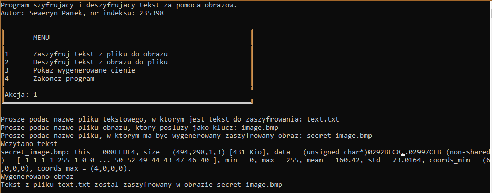
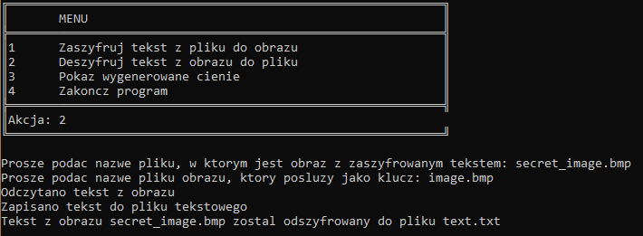
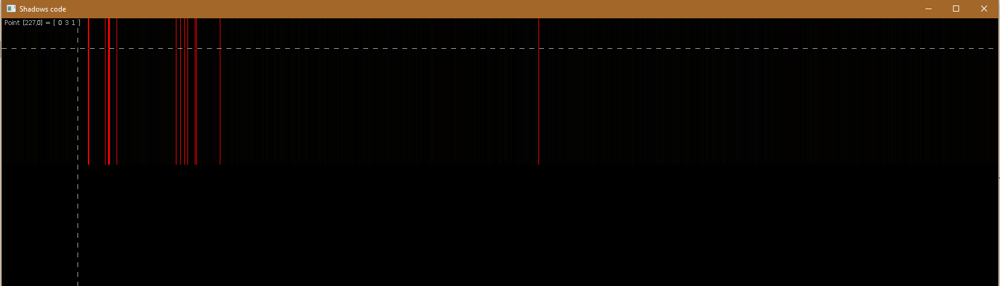

# Encrypting by images

A text encryption program using a designed symmetric algorithm that uses an image as a key.

## Table of contents
* [Encrypting by images](#encrypting-by-images)
	* [Programming language and library](#programming-language-and-library)
	* [Setup and usage](#setup-and-usage)
	* [Description of the algorithm](#description-of-the-algorithm)
	* [Example of usage](#example-of-usage)

## Programming language and library

The program code was written in C ++, the `main.cpp` file.

The `CImg-2.4.0/CImg` library was used to work with images. It was attached with a line:

	#include "CImg-2.4.0/CImg.h"

For more information, visit: https://github.com/dtschump/CImg

## Setup and usage

The compiled executable is `crypto.exe`. You can download it and run it.

If you want to make your own changes to the program code, download the file `main.cpp` and the library` CImg-2.4.0/CImg`.

## Description of the algorithm

Information about a given plaintext letter is stored in a single pixel of the output image.

The encryption or decryption of the nth character of plaintext involves a computation on the nth pixel of the image.

Each character of plaintext is represented by a number in binary. Such a sequence of bits is divided into 3 parts:
* bits 1, 2, 3 - red part,
* bits 4, 5, 6 - green part,
* bits 7, 8 - blue part.

The resulting 3 sequences of 0s and 1s (3 binary numbers) are converted to 3 decimal numbers.

Then the pixel is replaced with a brighter pixel - the values of the Red, Green and Blue components are increased by the previously calculated numbers (red part, green part and blue part).

## Example of usage

### Encryption

Let's create the file `text.txt` and fill it with the content:
>It's a secret information.
Do not share it with anyone.

For encryption, let's use the image `image.bmp`:

After starting the program, select the first option from the menu (encryption) and follow the next steps:
1. Indicate the name of the text file.
2. Specify the name of the image you want to use for encryption.
3. Specify the name of the output image.

Your image with encrypted text information has been created and saved. In this case, it looks like this:

You can see pixels that have changed color in the top left corner:

### Decryption

Prepare two images - with the encrypted information and the original image that will serve as the key.

After opening the program, select the second option from the menu and follow the steps:
1. Provide an image name with encrypted information.
2. Provide the name of the original image, key.

The decrypted text will be in the file `text.txt`.

### View changes you make to an input image

To see how the pixels in the original image have changed, you can use the third option from the menu.

Enter the name of the file where the plaintext is.

The pixels are displayed in one row as if they were overlaid on a black image taken as a key.

To achieve a better effect, below we have shown the obtained result for this encrypted README.md file (longer text):

